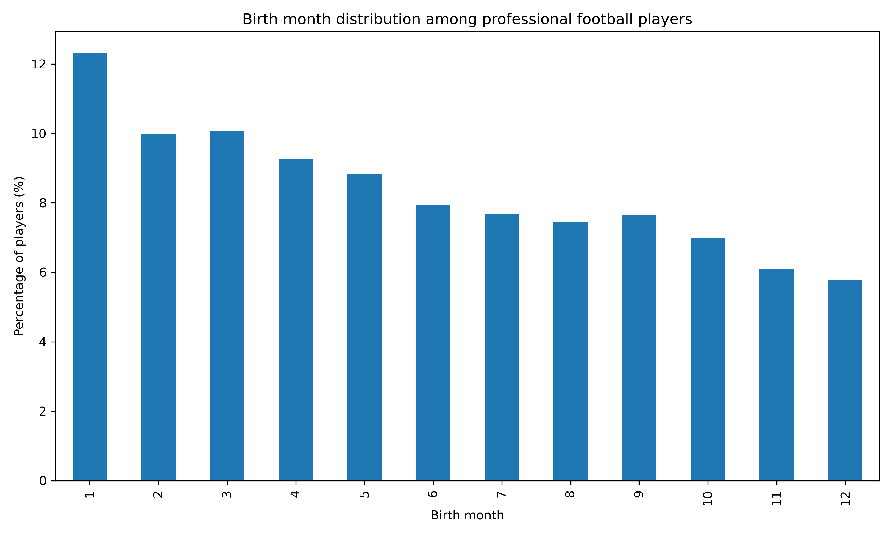

```
# Relative Age Effect in Professional Football



## 📌 Project Overview

This project analyzes the **Relative Age Effect (RAE)** in professional football, examining whether players born earlier in the calendar year are overrepresented among those who reach the professional level.

Using a large real-world dataset of professional football players, the analysis reveals a **clear and statistically significant bias** favoring players born in the first months of the year—particularly January—over those born at the end of the year.

---

## ❓ What is the Relative Age Effect?

In many youth football systems, age categories are defined by calendar year. As a result, players born earlier in the year are relatively older within the same age group.

This relative age advantage often translates into:
- Physical and developmental advantages
- Higher likelihood of early selection
- Greater access to training and competitive opportunities

Over time, these early advantages may accumulate and influence which players ultimately reach professional football.

---

## 📊 Dataset

- **Source**: Public real-world professional football player data (scraped from Transfermarkt)
- **Scope**: Global — professional players across multiple leagues and countries
- **Key variable**: `date_of_birth`

> ⚠️ Due to file size constraints, the raw and processed datasets are not included in this repository.  
> The analysis is fully reproducible once the data is downloaded locally.

Only players with valid birth dates were included in the analysis.

---

## 🛠️ Methodology

1. **Data preparation**
   - Parsed birth dates
   - Removed missing or invalid values
   - Created derived variables:
     - `birth_month`
     - `birth_quarter`

2. **Exploratory analysis**
   - Distribution of players by month of birth
   - Visual inspection of over- and under-representation

3. **Statistical testing**
   - Chi-square goodness-of-fit test
   - Null hypothesis: birth months are uniformly distributed

---

## 📈 Key Findings

- Players born in **Q1 (January–March)** are strongly overrepresented.
- Players born in **Q4 (October–December)** are significantly underrepresented.
- The chi-square test **rejects the null hypothesis of uniform distribution** (p < 0.05).

**Conclusion:**  
Birth month has a statistically significant impact on the likelihood of reaching professional football, confirming the presence of a strong Relative Age Effect.

---

## 📂 Repository Structure

```
data/
  raw/         # Raw dataset (not included due to size)
  processed/   # Cleaned dataset (not included due to size)

notebooks/
  01_exploracion_y_limpieza.ipynb
  02_analisis_estadistico.ipynb

figures/
  birth_month_distribution.png
```

---

## 🚀 How to Reproduce

```bash
pip install -r requirements.txt
```

Run the notebooks in order:
1. `01_exploracion_y_limpieza.ipynb`
2. `02_analisis_estadistico.ipynb`

---

## 🔮 Future Work

- Analyze the effect by **country or region**
- Compare **player positions**
- Study cohort effects across different decades

---

## 👤 Author

**Luciano Mosquén**  
Senior Data Analyst  
Python · SQL · Power BI
```
